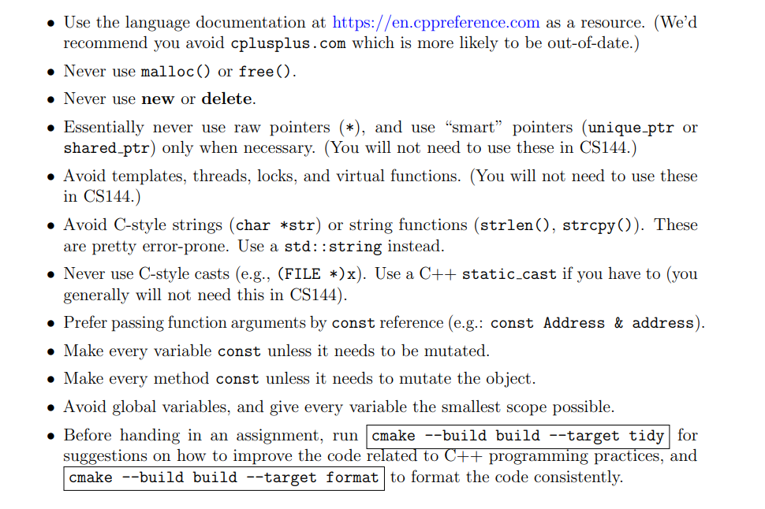

### 实验介绍
CS144Lab是斯坦福大学的一门计算机网络课程配套实验，实验的最后，你将实现一个简单的互联网协议栈。

资源：

- [课程官网 ](https://cs144.github.io)
- [视频课程](https://www.bilibili.com/video/BV137411Z7LR/?spm_id_from=333.337.search-card.all.click&vd_source=e97d03eca94901a34a288555c2befb19)
- [环境配置](https://stanford.edu/class/cs144/vm_howto/)
- [参考答案](https://github.com/PKUFlyingPig/CS144-Computer-Network)

### 环境配置
1. 从官网下载cs144的镜像，然后下载vm VirtualBox打开镜像文件。（我挂了梯子，下载依然比较慢，需要几个小时）
2. 使用纯命令行环境coding很不方便， 推荐使用vscode环境进行编辑。下载Remote -SSH插件，输入 cs144@127.0.0.1:2222 (虚拟机的端口号是2222)根据以上的配置方案可直接在vscode中进行编辑
3. VirtualBox的命令行比较难用，可以使用cmd远程连接

 在cmd中输入 
```
ssh -p 2222 cs144@127.0.0.1 
```
如果你遇到 network error: connection refused的报错，检查ssh服务是否已经打开
```
systemctl status ssh
```
如果问题仍然未解决，建议重新下载镜像文件。我尝试了很多方法依然无法远程连接虚拟机，在安装好虚拟机后，记得把项目保存在GitHub上，以防万一。


### 实验部分
#### · Fetch A Page
该部分希望我们动手获取一个网页，而不是在浏览器上直接输入网址，以此让我们熟悉一个网址的组成部分,在你的虚拟机中输入命令访问http://cs144.keithw.org/hello
```
# telnet是一个帮助你在两台计算机之间建立可靠的byte stream的程序
# 连接主机名为cs144.keithw.org的主机，端口号为默认值
telnet cs144.keithw.org http
# 请求路径为/hello的页面，使用HTTP1.1协议
GET /hello HTTP/1.1 
Host: cs144.keithw.org
Connection: close
Host: 
```
#### · Listening and connecting
现在我们在两台计算机（这里实际上是一台计算机的两个端口）之间进行通讯
```
# 在你的虚拟机上，对9090端口进行监听
netvat -v -l -p 9090
# 打开一个新的终端
# 连接到主机名为localhost的主机，端口号为9090
telnet localhost 9090
```
如果运行无误，你将看到类似““Connection from localhost 53500 received!”的提示，表明已经连接成功，不管你在第二个终端中输入什么，你都将在运行监听的终端中看到。输入ctrl-c结束
> 如果你的虚拟机无法打开多个终端，可以使用Putty等工具以远程连接的方式再开启一个终端
#### · 本实验要求的现代c++规范
实验规范相当有意思，不能使用new和delete，不要使用c的编程风格，变量的作用域尽可能小，要求使用静态代码分析工具。从实验的源代码中也可以发现，使用了一些现代c++的库和特性


#### · Writing a Webget
在cs144目录下克隆github项目
```
git clone https://github.com/cs144/minnow
```
- **强烈建议：在GitHub上备份你的项目**

检查git是否已安装
```
git --version
```
在minnow目录下初始化git仓库
```
git init
```
配置git文件
```
git config --global user.email "you@example.com"
git config --global user.name "Your Name"
```
>注意上面的名字才是你的用户名，这个是你在github上的唯一标识，下面这个是你在社区中显示的名字


在GitHub网页下新建一个仓库，将项目属性设置为private，其他保持默认就好

将本地项目与GitHub项目关联
```
git remote add origin <github仓库的URL>
```
配置.gitignore文件，要把build文件给忽略掉，.build文件存放的的源代码编译链接后的二进制文件，我们并不需要储存这些文件，而且这些文件很大，亲测若单个文件大于50m可能导致上传失败
```
echo "/build/">.gitignore
```
接下来将项目保存到GitHub（每次更改都执行一次）
```
# 将项目文件添加到暂存区
git add .
# 将暂存区文件提交到本地仓库
git commit -m "Init"
# 将本地更改推送至GitHub仓库
git push -u origin master
```
如果正确执行，你将看到

检查GitHub仓库是否已经更新
> 以后同步到GitHub的时候第三步可以简写成git push

进行项目构建
```
cd minnow
# 根据cmakelist文件生成构建系统需要的项目文件，放入build目录中
cmake -S . -B build
# 编译链接命令 生成可执行文件
cmake --build build
```


在阅读原有接口的基础上，实现get-URL函数，与之前的Fetch A Page类似，大约十行代码可以搞定。这源文件有点长，刚开始我有点捋不清各个接口的作用和各个类的继承关系，这里需要耐心点把源文件看完

----------
Socket函数的publice接口，实现socket的连接和关闭
```cpp
  //! Connect a socket to a specified peer address with [connect(2)](\ref man2::connect)
  void connect( const Address& address );

  //! Shut down a socket via [shutdown(2)](\ref man2::shutdown)
  void shutdown( int how );
```
address类的构造函数
```cpp
//! Construct by resolving a hostname and servicename.
  Address( const std::string& hostname, const std::string& service );
```
socket类的read和write函数，实现socket的读写操作
```cpp
// Read into `buffer`
  void read( std::string& buffer );
  void read( std::vector<std::string>& buffers );

  // Attempt to write a buffer
  // returns number of bytes written
  size_t write( std::string_view buffer );
  size_t write( const std::vector<std::string_view>& buffers );
  size_t write( const std::vector<std::string>& buffers );
```
有了以上的这些接口，接下来我们可以实现get_URL函数了
```cpp
void get_URL( const string& host, const string& path )
{
  TCPSocket my_socket;
  my_socket.connect(Address(host,"http"));
  string message;
  message += "GET " + path + " HTTP/1.1\r\n";
  message += "Host: " + host + "\r\n";
  message += "Connection: close\r\n\r\n";
  my_socket.write(message); 
  while(!my_socket.eof()){
    string my_string;
    my_socket.read(my_string);
    cout << my_string;
  }
  my_socket.shutdown(SHUT_RDWR);
}
```


#### · An in-memory reliable byte stream
#### · END 