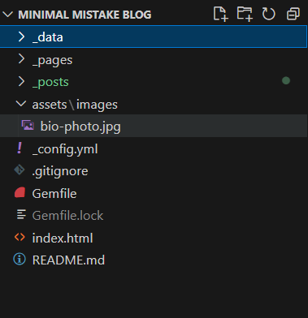
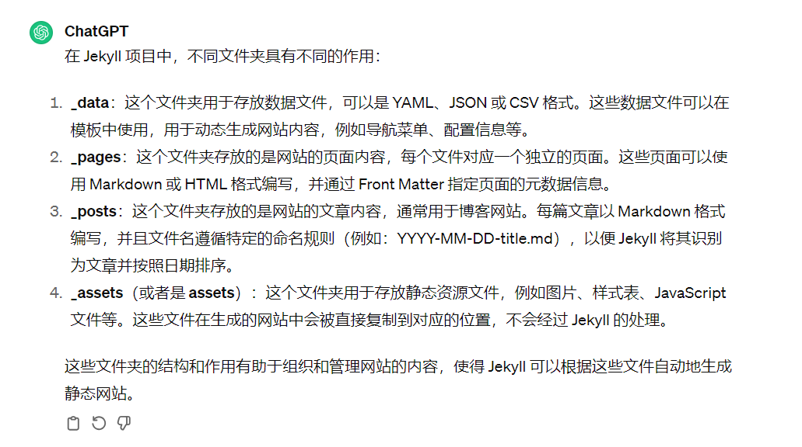
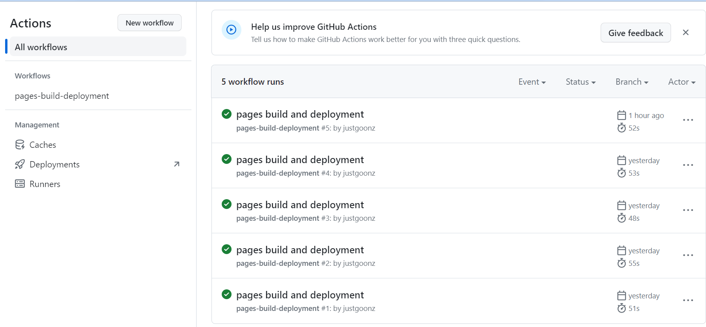

# 第一篇博客

## 项目配置

本站选择了 GitHub Pages + Jekyll 配置方案，具有零成本、简单易部署的优势。网上的教程已经非常完备，本文简单记录配置过程。

仓库地址：[jekyll](https://github.com/mmistakes/minimal-mistakes)

YouTube 教程：[jekyll_tutorial](https://www.youtube.com/watchv=LfP7Y9Ja6Qc&list=PLLAZ4kZ9dFpOPV5C5Ay0pHaa0RJFhcmcB&index=4)

在仓库的 README 文件中，根据提示新建一个自己的[仓库](https://github.com/new?template_name=mm-github-pages-starter&template_owner=mmistakes)，然后克隆到本地使用 VSCode 打开。修改一下配置文件便可以通过 `YourUsername.github.io` 访问到你的博客。

> 注意：如果想要使用 GitHub Pages，一定要将自己仓库的设定为 `YourUsername.github.io`，然后 GitHub 就会自动将你的仓库识别为 GitHub Pages 并自动帮你进行“pages build and deployment”。这种方法的弊端是只建一个这样的仓库，网上也有别的解决方案，这里不赘述。


## 项目结构



jekyll实际上是一个前端页面生成器，可以识别markdown代码生成前端页面，这里我偷懒放了OpenAI的解释

在设置好个性化配置文件后，我们只需将写好的文章按照jekyll的命名规则，将.md文件放在_post文件夹下即可。最后使用git将代码推送到远程仓库
如果你想使用图形化界面来进行版本管理，也可以使用GitHub Desktop

```
# 添加修改
git add .
# 提交修改
git commit -m "Update code"
# 推送到远程仓库
git push origin main
```

在仓库中的action栏可以看到远程仓库的workflows，push到仓库后平均不到一分钟便可以从网站页面上看到内容更新，速度相当可观。
