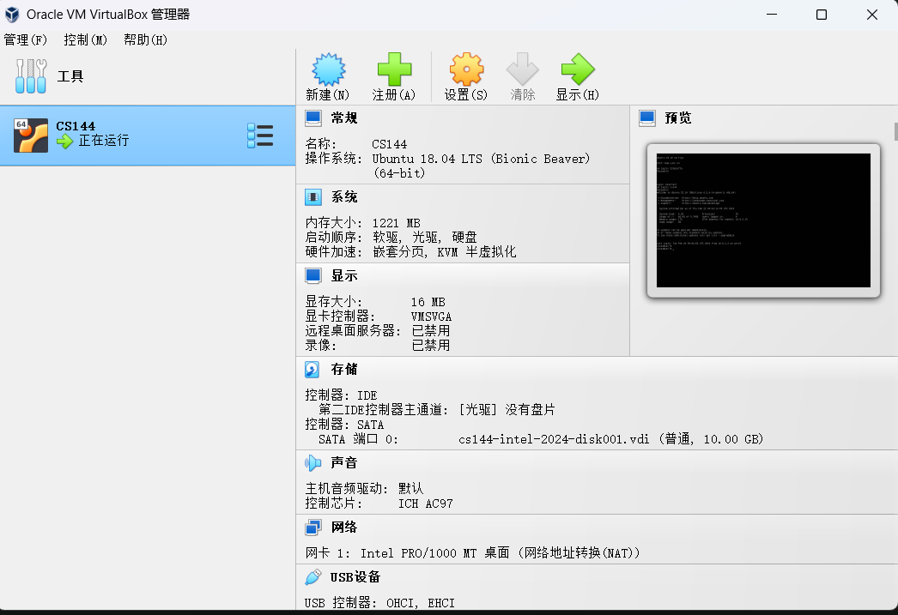

## 一些经历过的Bug:cry:
#### jekyll文章发布延迟
- 问题：发博客的时候，我写完文章提交到GitHub后，网站会延迟很长时间才更新。

- 原因：GitHub采用格林尼治标准时间[date: 2018-12-31 12:27:40 +0800]，而我的文件名时间是这样的[2024-02-21]这就造成了缺省时区的情况下GitHub误以为我的时间是远程主机所在地区的时间。这很可能是一个未来的时间，而jekyll的配置文件规定不允许发送未来时间的博客，所以新的post不会在网页上被渲染
- 解决方案：可以使用更精确的时间，也可以前一天的日期进行发布。

------

#### 环境变量问题
- 问题：添加环境变量中的path后依然无法通过命令行执行程序
- 解决方案： 通常我们将某个软件中的bin文件夹放入环境变量中，这次我安装的软件只有一个.exe文件，于是我想当然的把该文件的路径加入环境变量中了。于是遇到了以上的问题，其实应该吧该文件所在的文件夹的路径加入环境变量中才能被系统正确识别

------

#### VirtualBox重装后无法导入虚拟机
- 问题：重装虚拟机软件后，导入文件时，发现虚拟机镜像从.ova文件变成了.vdi文件了，无法导入。
- 解决方案： 首先得明白这两个文件的差别:
(1) Open Virtualization Appliance（OVA）是一种用于打包和分发**虚拟机**的文件格式。它通常包含了一个虚拟机的配置信息、磁盘镜像文件以及其他相关文件，以便于导入到虚拟化平台中,当你导入 .ova 文件时，虚拟化平台会**自动解压**并配置其中的内容
(2)Virtual Disk Image（VDI）是一种虚拟磁盘镜像文件格式，用于存储**虚拟机的硬盘内容**。这些文件通常包含了虚拟机的操作系统、应用程序和数据。
当我们将.ova文件导入虚拟机软件后，便会由虚拟机软件自动解压成.vdi文件，重装软件后，点击新建一个系统，然后选择对应的操作系统版本,在虚拟存储介质中选择我们的.vdi文件，点击创建，我们的虚拟机就回来了:heart_eyes:
