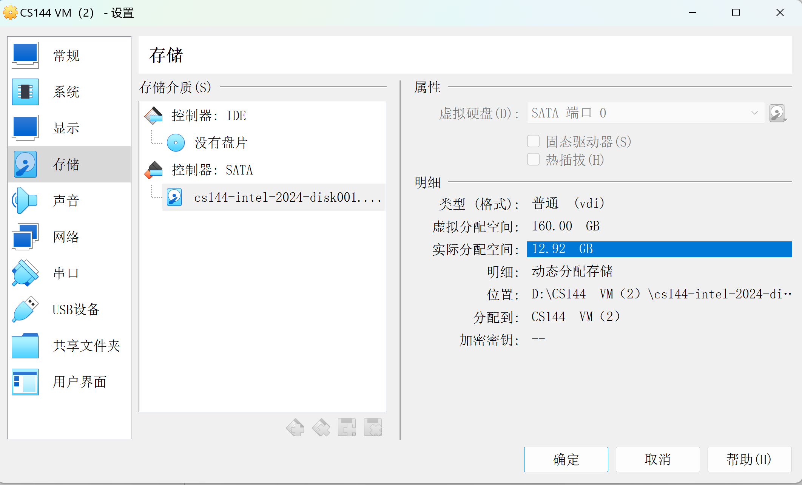

*今天在项目中编译代码的时候报错磁盘空间不足，需要给运行在VirtualBox的ubuntu虚拟机扩容，查了一些资料，对于学习linux环境的文件系统很有帮助，记录一下~*


### 给虚拟机分配磁盘空间
在虚拟机软件给虚拟机分配空间，再次启动虚拟机，发现虚拟分配空间变成了160G，而**实际分配空间**还是原来的数值，编译代码仍然报错空间不足；

在虚拟机中输入命令
```
df -h
```
并没有找到新增的空间
这是因为我们软件只是虚拟的分配了空间,并没有实际分配空间.还需要虚拟机把空间""取过来""才能使用
> 相当于,妈妈允许儿子吃糖果,但是如果儿子不拿糖果来吃.那么吃糖果这个事件就不会实际发生
### 添加磁盘分区
```
# 添加一个磁盘分区
sudo fdisk /dev/sda
# 依次输入以下参数
n
p
p
w
# 对新区格式化,把`/dev/sda3`替换成新增磁盘的实际路径
sudo mkfs -t ext4 /dev/sda3
```
然后磁盘分区就添加好了
输入`df -h`检查新增的磁盘分区是否已存在
### 挂载磁盘
磁盘分区已经新建好了,就像windows电脑里的DCE盘一样,最后要告诉linux系统要把磁盘放在什么位置

查看UUID,这是磁盘的标识
```
# 如果你的文件系统是ext4,修改相应参数
lsblk -f | grep ext4
```
把这个分区加入挂载磁盘的配置文件中
```
sudo vim /etc/fstab
```
在文件夹中添加一行
**注意不要直接copy,务必先修改参数**
```
UUID=”6104d5b3-344e-4eab-a3fa-45555a8b164a” /mnt/sdc ext4 defaults 0 2
```
- 第一个参数是UUID,分区的标识
- 第二个参数是磁盘的挂载点
> 意思就是,挂载点下的文件会放在这个新增的磁盘中
- 第三个参数是文件系统的类型
- 第四个参数是dump备份设置,当其值设置为1时，将允许dump备份程序备份；设置为0时，忽略备份操作；
- 第五个参数,当其值为0时，永远不检查；而 / 根目录分区永远都为1。其它分区从2开始，数字越小越先检查，如果两个分区的数字相同，则同时检查。

最后重启虚拟机
```
reboot
```

> 后记 
> 想某一项技术的最好办法就是使用他.计算机是一门重实践的学科,也许你目前不需要git版本管理,不需要docker,不需要linux系统,不需要使用python虚拟环境,但是多折腾一下,也许无形中就是最好的进步方法.
